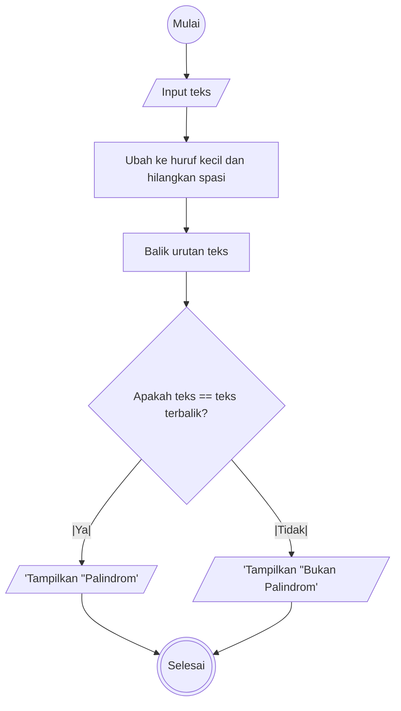

# Algoritma dan Flowchart Palindorm
1. Mulai
1. Input teks
1. Ubah teks menjadi huruf kecil dan hilangkan spasi
1. Balik urutan teks
1. Bandingkan teks asli dengan teks terbalik
1. Jika sama, tampilkan "Palindrom"
1. Jika tidak, tampilkan "Bukan Palindrom"
1. Selesai



# Algoritma dan Flowchart Reverse word
1. Mulai
1. Input teks
1. Pisahkan teks menjadi kata-kata
1. Balikkan urutan kata
1. Gabungkan kata-kata yang sudah dibalik menjadi sebuah kalimat
1. Tampilkan hasil
1. Selesai

```mermaid
flowchart TD
    A((Mulai)) --> B[/Input teks/]
    B --> C[Pisahkan teks menjadi kata-kata]
    C --> D[Balikkan urutan kata]
    D --> E[Gabungkan kata-kata yang dibalik]
    E --> F[/Output teks/]
    F --> G(((Selesai)))


